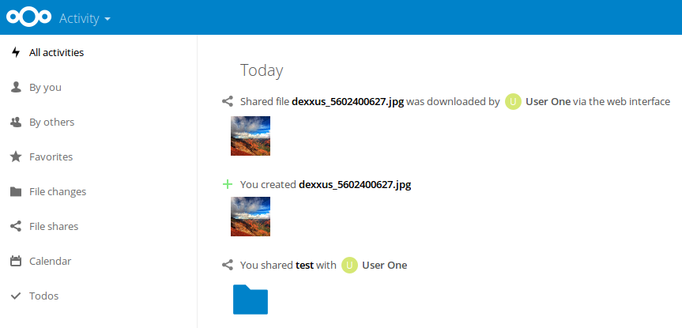

<!--
  - SPDX-FileCopyrightText: 2016 Nextcloud GmbH and Nextcloud contributors
  - SPDX-License-Identifier: AGPL-3.0-or-later
-->
# Activities for shared file downloads

Creates activities for downloads of files that were shared with other users or a group

The feature is controllable via the `A local shared file or folder was downloaded` setting on the personal page.
